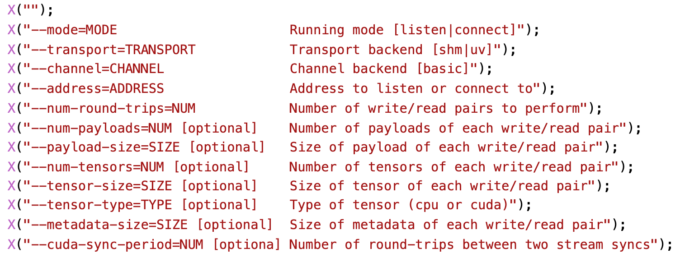

# Run Benchmark

- Clone this project
- Build the project following the [README.md](./README.md)
- Change directory to `buid/tensorpipe/benchmark`

Here is an example of running pipe benchmark on komodo02 and komodo03, we start a feature server on komodo02 and start a client on komodo03. Here are all parameter options, but I hardcoded num_tensors as 1 and tensor_size as 128MB in [benchmark_pipe.cc](tensorpipe/benchmark/benchmark_pipe.cc), you can change it if you like.

I suggest you set `num-round-trips` larger than 5 because the default warm-up need 5 round-trips.

`benchmark_pipe` will test data transmition bandwidth using IB, client sends data to server.

**Run Server**

    ./benchmark_pipe --mode listen --transport ibv --channel basic --address ibv://155.198.152.17:3344 --num-round-trips 10

**Run Client**

    ./benchmark_pipe --mode listen --transport ibv --channel basic --address ibv://155.198.152.17:3344 --num-round-trips 10

